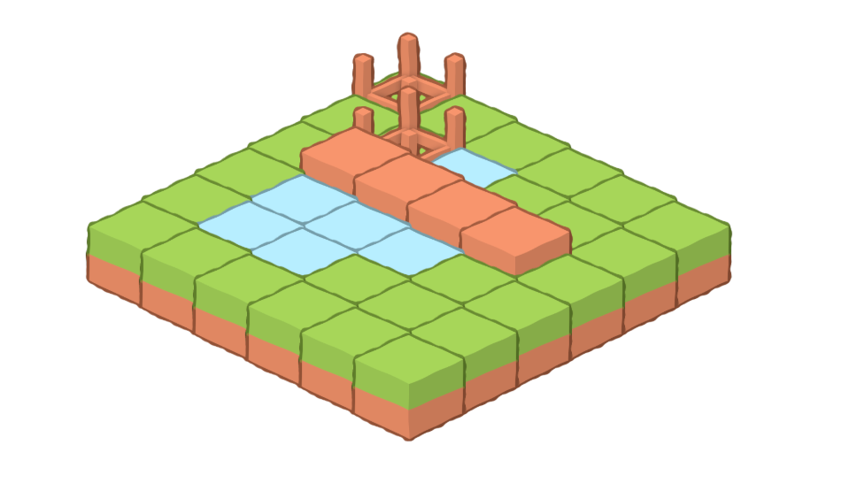

## Turbo Robots - The Turbo Era

In 2025 I finally got the idea I was looking for in 2017:
> I will implement a Web gui for Turbo Robots and I will see how far can I
> go without writing custom Javascript.

I am only allowed to use Turbo.

This is the challenge and the fun part of this idea.

## Replays

The Web Gui that I want to build is not to actually play the game.
I already have implemented a TCP Server and TCP clients that can play the game, so I will focus on
replays.
The idea is much simpler: open an existing game, and replay it in the browser.
If this works, I can then extend its use in the future.

## Architecture

The architecture is very simple:

* `database`: already exists. Is a single sqlite file generated by the TCP server. In there I'll find the games I am
  looking for.
* `engine`: I already have implemented in Ruby. It provides me all the ActiveRecord models to interact with the game.
* `web`: a Sinatra app that will use the `engine` to provide a Web GUI to replay the games.
* `css`: no need for a CSS library or framework.

## Sprites

I started looking for sprites and I ended up using some from [Kenney](https://kenney.nl/), in
particular [this set](https://kenney.nl/assets/sketch-town) and I was mostly guided
by [this blog post](https://observablehq.com/@senritsu/isometric-tiles-with-css-grid) in my attempt to draw a map.

## Draw the map

The Sinatra app is dead simple:

```ruby
class TurboRobots < Sinatra::Base
  get '/games/:game_id' do
    game_id = params[:game_id].to_i
    game = TurboRobots::Game.find(game_id)
    erb :show, locals: { game: game}
  end
end
```
Our map is a 2D array of tiles, and each tile has a type (grass, water, etc.) and a sprite.

```
@.....
.@~...
.####.
.~~~..
.~~...
......
```

The isometric representation looks as follows:



The map is rendered using CSS and HTML. 
We need a container for the field, and an element for each tile. 
This is how the code looks like:

```erb
  <% map.each_with_index do |row, row_index| %>
    <% row.each_with_index do |cell, col_index| %>
      <% x, y = iso_position(row_index, col_index) %>
      <% left = "calc((#{col_index} - #{row_index}) * (var(--tileWidth)  / 2))" %>
      <% top =  "calc((#{col_index} + #{row_index}) * (var(--tileHeight) / 2))"%>
      <% z_index = row_index + col_index%>

      <div class="tile" id="cell<%= row_index %>-<%= col_index %>"
           style="left: <%= left %>; top: <%= top %>; z-index:<%= z_index %>;">
        .png" class="tile-image">
      </div>
    <% end %>
  <% end %>
```
