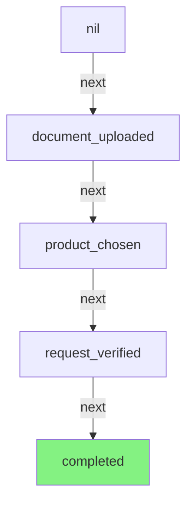
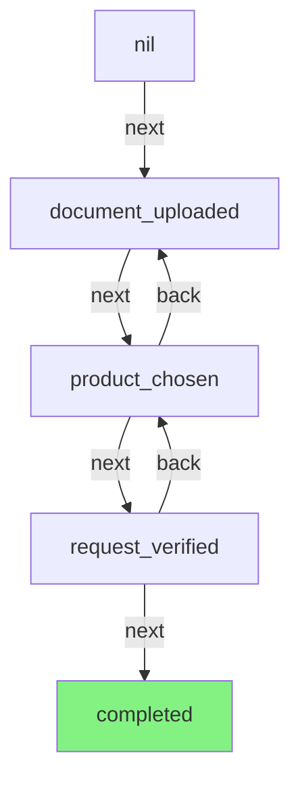
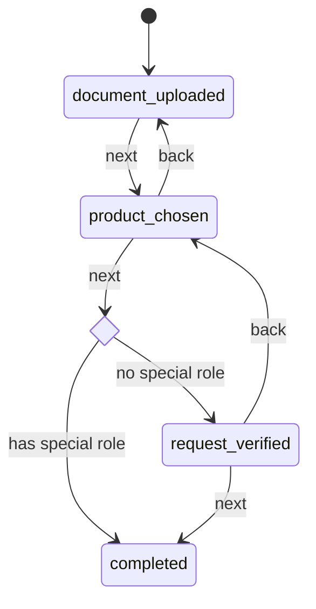

## What is a state machine in this context

We talk about a state machine when we have a model (a record) that can be at any given time in a single **state**.
This happens, for example, in wizards, where the form displayed changes depending on the current state of the model, and
the model can only be in a single state at a given time.

Next to that, we have **transitions**: which represent the **method** that allows moving the model from a state to
another.

The last element of a state machine is the **action**. This is basically the **transition** or **method** implementation
and the set of changes that are applied to the model before moving to the new **state**.

## Our case

In our case we have a **CreditCardRequest**. The wizard allows the operator to go through the following states:



We have different **states**, a single "next" **transition**, and we don't show for now the **action**.

The operator can go **back** so let's enrich the state machine accordingly:



our actions look as follow:

```ruby

STATES = [:document_uploaded, :product_chosen, :request_verified, :completed]

def next
  raise if self.status == STATES.last
  self.status = STATES[STATES.index(status) + 1]
end

def back
  raise if self.status == STATES.first
  self.status = STATES[STATES.index(status) - 1]
end
```

implemented in [aasm](https://github.com/aasm/aasm) it looks as follows:

```ruby

class CreditCardRequest < ApplicationRecord
  aasm do
    state :document_uploaded, initial: true
    event :next do
      transitions from: :document_uploaded, to: :product_chosen
      transitions from: :product_chosen, to: :request_verified
      transitions from: :request_verified, to: :completed
    end

    event :back do
      transitions from: :request_verified, to: :product_chosen
      transitions from: :product_chosen, to: :document_uploaded
    end
  end
end
```

We could argue which of the two versions look better, but something is really important at this point and will become
even more relevant afterwards: when using `aasm`, you need to learn a new syntax and DSL. A new developer will have to
understand the gem, the events and the transitions. In the code above, for example, is important to know that the
first "matching" transition, skips the subsequent ones.

This is a first important obstacle when introducing a new gem with a new DSL. That's true also
for [cancancan](https://github.com/CanCanCommunity/cancancan) that I maintain since 2015.

## Set the operator

When entering the status completed, we need to set the operator that completed the operation.
We can do so by using `after`

```ruby
event :next do
  transitions from: :document_uploaded, to: :product_chosen
  transitions from: :product_chosen, to: :request_verified
  transitions from: :request_verified, to: :completed, after: -> { self.operator = Current.operator }
end
```

## A special role

If an operator has a special role they can skip the request_verified state and go directly to complete.

```ruby
class CreditCardRequest < ApplicationRecord
  aasm do
    state :completed, after_enter: -> { self.operator = Current.operator }

    event :next do
      transitions from: :document_uploaded, to: :product_chosen
      transitions from: :product_chosen, to: :completed, if: -> { Current.operator.has_special_role? }
      transitions from: :product_chosen, to: :request_verified
      transitions from: :request_verified, to: :completed
    end
  end
end
```

Now the state will transition correctly to `completed` from `product_chosen`, when the operator has enough rights.
We also moved the operator assignment in the `after_enter` of the state to avoid duplicated logic.

I consider `after_enter` still confusing because in ActiveRecord I am used to deal with other callbacks, and just by
reading the code it's not clear if this happens before or after commit (it happens before). Also what the difference is
exactly between `before_enter` and `after_enter`, although I think in this specifc case it does not matter.

All of a sudden the state machine flow became a bit harder to follow, unfortunately, but an LLM can easily generate a marmeid graph from the copde above. Here is the result:





## Mark with missing information

If during the process some information are missing, the request should be put in status `missing_information`.
From missing information, when restored, they go back to `product_chosen`
How we initially implemented this was to check if the data included any missing information during the `next` transition.

```ruby
event :next do
    transitions from: :product_chosen, to: :missing_information, if: -> { missing_information.present? }
    transitions from: :product_chosen, to: :completed, if: -> { Current.operator.has_special_role? }
    transitions from: :product_chosen,  to: :request_verified
    transitions from: :request_verified,   to: :completed
    transitions from: :missing_information,  to: :product_chosen
end
```

Here we start seeing mistakes happening: is there always a single `next` event or we should rather have different events, like `mark_as_missing_information` and `continue_missing_information`?

I believe the second approach would be better, because the event is actually triggered by the operator **explicitly**.
> The events should be triggerable from external.

Let's refactor this:

```ruby
aasm do
  state :completed, after_enter: -> { self.operator = Current.operator }
  
  event :next do
    transitions from: :document_uploaded, to: :product_chosen
    transitions from: :product_chosen, to: :missing_information, if: -> { missing_information.present? }
    transitions from: :product_chosen, to: :completed, if: -> { Current.operator.has_special_role? }
    transitions from: :product_chosen, to: :request_verified
    transitions from: :request_verified,   to: :completed
  end
  
  event :mark_as_missing_information do
    transitions from: :product_chosen, to: :missing_information, if: -> { missing_information.present? }
  end
  
  event :continue_missing_information do
    transitions from: :missing_information, to: :product_chosen
  end
end
```

This is in my opinion a much better version, that makes it clear that those events can be triggered from outside the model.

## What if we did not have aasm?
