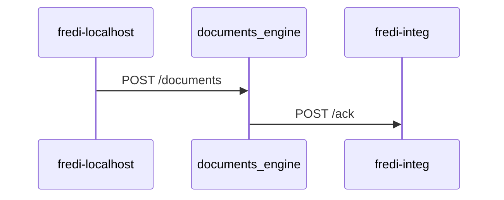

## The problem

The subject of this problem is a rather complex Rails application; not only because it has a lot of features, but mostly
because it is highly coupled with at least another three applications.

The application is incredibly well tested: we reach 100% code coverage and 98% branch coverage without system tests.

On top of that, we have another good set of system tests that goes through the entire app and test all the happy paths
from the beginning until the end.

But this is not enough.

## Highly-coupled apps

I consider two applications highly coupled when they exchange data in both directions.
Our app is called `fredi`, and it consists of a wizard to verify the data of a customer before issuing a credit card.
`fredi` sends the documents to the `documents_engine` and receives an `acknowledge` async call.


System tests don't help us in this case because the documents_engine will send an API call to our instance of `fredi`,
but on the INTEG environment.

To clarify this, check this web diagram flow:



In our system tests we can only mock the API call `POST /ack` to our application, but we will never be able to test end
to end.

## Live tests

The only option left, is to execute our tests directly on INTEG. Once the application is deployed.

So basically good, old, smoke tests.

But what if we could automate those as well? Let's introduce live tests!

Live tests are nothing more than standard system tests that connect to a remove, running, server.
This all built-in in Rails and with some small changes, we can have them up and running in no time.

```ruby
require "test_helper"

class LiveTest < ActionDispatch::SystemTestCase
  def setup
    Capybara.default_driver = :selenium_chrome # use :selenium_chrome_headless if you don’t want the window
    Capybara.app_host = "https://integ.example.com"
    Capybara.run_server = false
  end

  def teardown
    Capybara.reset_sessions!
  end

  def test_flow
    visit "/users/sign_in"
    fill_in('E-Mail', with: ENV.fetch("LIVE_TESTS_USER_EMAIL"))
    fill_in('Password', with: ENV.fetch("LIVE_TESTS_USER_PASSWORD"))
    click_button('Login')

    assert_content I18n.t("devise.sessions.signed_in")
  end
end
```

The particularity of this system test is the setup:

```
Capybara.default_driver = :selenium_chrome
Capybara.app_host = "https://integ.example.com"
Capybara.run_server = false
```

We are not executing our test against a running instance of our app, so we need to point to a separate URL, and specify
that it does not need to run its own server.

The rest of the script is navigating, filling fields and clicking buttons as usual.

One note: we don't want to run this test alongside the other tests because **the moment** in which this test runs is
different.

We want to run our live tests **after** the deployment has succeeded, to check if our new version is correctly working.

That's why we want to introduce a `rails test:live` command and have those tests live under `test/live` instead of
`test/system`.

Here is the content for `lib/tasks/live_tests.rake`:

```ruby
require "rake/testtask"

namespace :test do
  desc "Run LIVE Capybara system tests under test/live"
  Rake::TestTask.new(:live) do |t|
    t.pattern = "test/live/**/*_test.rb"
    t.libs << "test"
    t.verbose = false
    t.warning = false
  end
end

```

Of course, I expect that you can re-use plenty of the code already written for your system tests.

## Database connection

When running live tests you have two options: either you connect to INTEG database: specify DATABASE_URL and point to the database of INTEG environment or you disable the Database connection.

The second option needs some adaptations. 

Add the `gem "activerecord-nulldb-adapter"` to your Gemfile and add

```ruby
ActiveRecord::Migration.define_singleton_method(:maintain_test_schema!) {}
# before require "rails/test_help"
```

to your `test/test_helper.rb`, so that it does not check if your schema is up-to-date.

## Strategy

You also need a strategy on how to act upon failing live tests.

I personally like to be alerted, but not to roll back a release: the risk of reverting a working release is too high;
I can simply re-run the live tests locally and see what the problem is before deciding if a rollback is necessary or the
live tests need to be adjusted.

Finally, this is how my pipeline looks like after introducing live tests:


