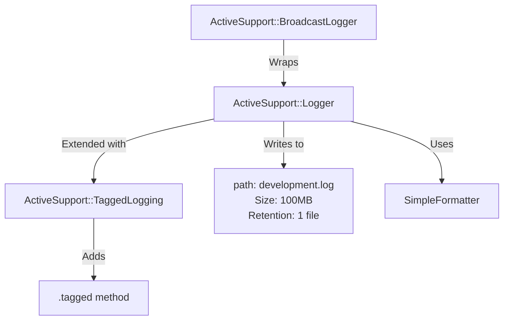

## Onlylogs

At [Renuo](https://renuo.ch), we are building a new platform/Rails Engine that allows you to analyse your logs via a Web
GUI.  Because of that, we had the chance of digging deeper into how Rails loggers work.

Here is a summary of our findings:

### Rails.logger default

The default Rails logger is an instance of [`ActiveSupport::BroadcastLogger`](https://api.rubyonrails.org/classes/ActiveSupport/BroadcastLogger.html).

> The Broadcast logger is a logger used to write messages to multiple IO. It is commonly used in development to display
> messages on STDOUT and also write them to a file (development.log). With the Broadcast logger, you can broadcast your
> logs to a unlimited number of sinks.

This is initialized by bootstrap.rb in an `initializer :initialize_logger` block.

The `BroadcastLogger` is just a wrapper around the "real" logger. By default, this is an instance of [
`ActiveSupport::Logger`](https://api.rubyonrails.org/classes/ActiveSupport/Logger.html).

`ActiveSupport::Logger` extends the default ruby `Logger` class with some differences:

* it offers a `silence`: which allows to silence log messages up to a certain level in a block:

```ruby
Rails.logger.silence(Logger::INFO) do
  # sets the minimum level to INFO for this block
  Rails.logger.debug { "hello" } # not printed
end
```

* it configures a default `SimpleFormatter` that displays the message as it is.

So in development, by default, we have a AS::BroadcastLogger that wraps a AS::Logger, which extends Logger.

It also comes with a default maximum file size of `100 * 1024 * 1024` (`100MB`) and a single retention file.

But this is not all, by default, `AS::TaggedLogging` features and methods are also attached to the logger.
This module extends the logger with a new method `.tagged` that allows to prepend the message with tags.

```ruby
Rails.logger.tagged("tag1", "tag2").debug { "hello" }
#=> [tag1] [tag2] hello
```



## Configuration

Rails offers different configuration options on every level, and here stuff gets complicated. Let's see them:

**config.log_level**: changes the minimum log level printed on screen

**config.default_log_file**: change the file path from log/development.log to something else

**config.log_file_size**: you can change the default maximum file size

**config.log_formatter**: changes the formatter from SimpleFormatter to whatever you want

**config.log_tags**: adds tags to your logged line

Let's see some examples and some counter-intuitive cases:

```ruby
Rails.logger.info "my message"
#=> "my message"
```

if we configure log tags and repeat the example:

```ruby
config.log_tags = [
  :request_id, # a unique request id
  ->(req) { Time.now.utc.iso8601 } # the current timestamp
]

Rails.logger.info "my message"
#=> "my message"
```

log tags were not used. But, if you perform a controller request, they are going to be there:

```
[bca3c681-4d82-4690-ad60-37ce36158256] [2025-08-25T11:17:05Z] Started GET "/" for 127.0.0.1 at 2025-08-25 13:17:05 +0200
```

this is because when we invoke `Rails.logger.info` directly the tags have not been "pushed" into the logger.
What we need to do is:

```ruby
Rails.logger.push_tags("mytag1", Time.now.utc.iso8601)
Rails.logger.info "my message"
#=> [mytag1] [2025-08-25T11:23:38Z] my message
Rails.logger.pop_tags(2)
```

[`Rails::Rack::Logger`](https://api.rubyonrails.org/classes/Rails/Rack/Logger.html) is the missing piece of the puzzle
here.
It basically takes care of pushing and popping tags into the logger around your request.
This is also why a direct call to `Rails.logger.info` would have no tags when done via console, but will have its tags
correctly attached when done in a controller:

```ruby

def index
  Rails.logger.info("here is a test")
end

# [bb6cae30-6031-4b3e-8384-8352e0cab32e] [2025-08-25T11:27:08Z] Started GET "/" for 127.0.0.1 at 2025-08-25 13:27:08 +0200
# [bb6cae30-6031-4b3e-8384-8352e0cab32e] [2025-08-25T11:27:08Z] here is a test
```

```ruby

class OnlylogsFormatter < ActiveSupport::Logger::SimpleFormatter
  def call(severity, time, progname, msg)
    "onlylogs --> #{super} <--\n"
  end
end

config.logger.formatter = OnlylogsFormatter.new

Rails.logger.info("here is a test")
```

Let's make a game. What will the output be between these two?

```
[4113f0bd-222a-4917-8dbb-4665ed4df378] [2025-08-25T11:45:19Z] onlylogs --> here is a test <--
```

```
onlylogs --> [4113f0bd-222a-4917-8dbb-4665ed4df378] [2025-08-25T11:45:19Z] here is a test <--
```

<details>
    <summary>Reveal answer</summary>
    <p>The second one. The tags are, in fact, applied to the message <b>before</b> is passed to the formatter.</p>
</details>

## What happens when you install lograge?

What is important to understand here, is that [`lograge`](https://github.com/roidrage/lograge) does change the
logger or the formatter, but changes how logs are written, because it needs to basically collect multiple log messages
and merge them into one. Still, it uses your defined configuration

```ruby

class OnlylogsFormatter < ActiveSupport::Logger::SimpleFormatter
  def call(severity, time, progname, msg)
    "onlylogs --> #{super} <--\n"
  end
end

config.logger.formatter = OnlylogsFormatter.new
config.lograge.enabled = true

#=> onlylogs --> [f5326485-4c2b-4e03-8e12-273d714faf39] [2025-08-25T12:11:25Z] method=GET path=/ format=html controller=Devise::SessionsController action=new status=200 allocations=876879 duration=501.01 view=287.27 db=15.03 <--
```

## How does this apply to onlylogs?

Onlylogs is designed to digest the logs no matter what. It treats your logs for what they are: text files, and allows you
to search through them as you would normally do in a text file. Onlylogs is still work in progress at the current time. 
I'll write more about it when we have something more concrete to show. 
